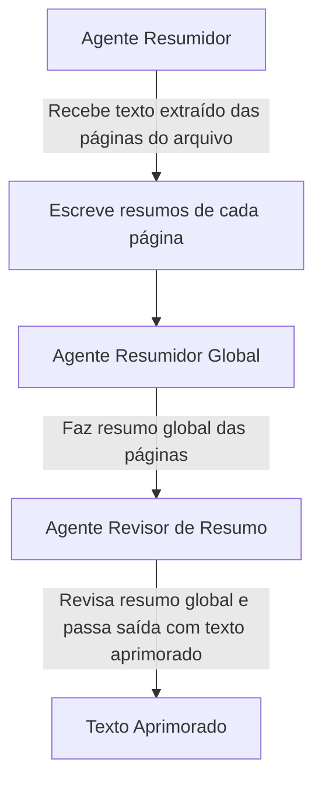

# RELATÓRIO TÉCNICO

Dados do experimento:
- ID do experimento: 2024-06-05_15-29-02
- Data: 2024-06-05
- Hora: 15-29-02

Autor(es):
- Lays


## Sumário executivo

- Protótipo de uma ferramenta de automação de tarefas, permitindo que os agentes utilizem uma funcionalidade em Python para extrair textos de arquivos PDF e resumir brevemente o conteúdo.


## 1. Introdução

- É uma ferramenta desenvolvida com o propósito de explorar o framework CrewAI, oferecendo funcionalidades que se adequam às necessidades do setor.


## 2. Procedimento experimental

### 2.1. Materiais:

LLMs:
- llama3-70b-8192

### 2.2. Métodos

Configuração experimental:

- Agentes: agente_resumidor_por_pagina, agente_de_resumo_global, agente_revisor_do_resumo_global.
- Tarefas: tarefa_resumo_paginas, tarefa_de_resumo_global, tarefa_de_revisão_de_resumo_global.
- Objetivos: Possibilitar que os agentes elaborem resumos claros e concisos dos textos extraídos de arquivos PDF utilizando uma função em Python externa ao framework.

- Fluxo dos agentes:



## Resultados/Análise

- Foi necessário adaptar o código, reduzindo a quantidade de tokens, para que o kickoff fosse executado sem erros.

```
[DEBUG]: == Working Agent: Resumir textos
 [DEBUG]: == [Resumir textos] Task output: 
 
**Page 1:**
Resumo: Este trabalho apresenta os elementos que constituem a estrutura de um artigo científico, apresentando as regras de apresentação, resumo, citação no texto e referências, baseadas na norma NBR 6022 de 2003.

**Page 2:**
Resumo: As orientações para a elaboração de um artigo científico são baseadas na norma ABNT NBR 6022, 2003, que apresenta os elementos que constituem um artigo científico. Além disso, é importante consultar as normas ABNT NBR 6023, 6024, 6028 e 10520.

**Page 3:**
Resumo: O artigo científico pode ser original ou de revisão, e sua estrutura é composta por pré-textual, textual e pós-textual. A estrutura do artigo científico inclui título, resumo, palavras-chave, introdução, desenvolvimento, conclusões e referências.

**Page 4:**
Resumo: Os elementos pré-textuais incluem título, autoria, currículo, resumo e palavras-chave. O resumo deve apresentar os objetivos, metodologia e resultados alcançados, não ultrapassando 250 palavras.

**Page 5:**
Resumo: Os elementos textuais incluem introdução, desenvolvimento e conclusões. A introdução deve apresentar o assunto objeto de estudo, ponto de vista e justificativas. O desenvolvimento deve apresentar a fundamentação teórica, metodologia, resultados e discussão.

**Page 6:**
Resumo: Os elementos pós-textuais incluem título e subtítulo em língua estrangeira, resumo em língua estrangeira, palavras-chave em língua estrangeira, notas explicativas, referências, glossário, apêndices e anexos.

**Page 7:**
Resumo: As ilustrações devem ter uma numeração seqüencial e ser identificadas por letras maiúsculas consecutivas. As referências devem ser alinhadas somente à margem esquerda e apresentadas em ordem alfabética de autor.

**References:**
Resumo: A lista de referências inclui as normas ABNT NBR 6022, 6023, 6024, 6028, 10520 e 14724, além de outras fontes citadas no texto.

 [DEBUG]: == Working Agent: Resumidor Global


> Entering new CrewAgentExecutor chain...
I now can give a great answer!

Final Answer:

Este trabalho apresenta as diretrizes para a elaboração de um artigo científico, baseadas na norma ABNT NBR 6022 de 2003. A estrutura do artigo científico é composta por pré-textual, textual e pós-textual. Os elementos pré-textuais incluem título, autoria, currículo, resumo e palavras-chave. O resumo deve apresentar os objetivos, metodologia e resultados alcançados, não ultrapassando 250 palavras. Os elementos textuais incluem introdução, desenvolvimento e conclusões. A introdução deve apresentar o assunto objeto de estudo, ponto de vista e justificativas. O desenvolvimento deve apresentar a fundamentação teórica, metodologia, resultados e discussão. Os elementos pós-textuais incluem título e subtítulo em língua estrangeira, resumo em língua estrangeira, palavras-chave em língua estrangeira, notas explicativas, referências, glossário, apêndices e anexos. As ilustrações devem ter uma numeração seqüencial e ser identificadas por letras maiúsculas consecutivas. As referências devem ser alinhadas somente à margem esquerda e apresentadas em ordem alfabética de autor. A lista de referências inclui as normas ABNT NBR 6022, 6023, 6024, 6028, 10520 e 14724, além de outras fontes citadas no texto.


 [DEBUG]: == Working Agent: Revisor de Resumos


> Entering new CrewAgentExecutor chain...
I now can give a great answer!

Final Answer:

**Diretrizes para a Elaboração de um Artigo Científico**

**Resumo**

Este trabalho apresenta as diretrizes para a elaboração de um artigo científico, baseadas na norma ABNT NBR 6022 de 2003. O artigo científico é composto por três seções principais: pré-textual, textual e pós-textual. A estrutura do artigo científico inclui título, autoria, currículo, resumo e palavras-chave, seguido de introdução, desenvolvimento e conclusões. Além disso, o artigo científico deve incluir elementos pós-textuais, como título e subtítulo em língua estrangeira, resumo em língua estrangeira, palavras-chave em língua estrangeira, notas explicativas, referências, glossário, apêndices e anexos.

**Introdução**

A elaboração de um artigo científico é um processo complexo que requer atenção a detalhes e conhecimento das normas e padrões estabelecidos. A norma ABNT NBR 6022 de 2003 fornece as diretrizes para a elaboração de artigos científicos, garantindo a qualidade e a consistência dos trabalhos acadêmicos.

**Desenvolvimento**

A estrutura do artigo científico é composta por três seções principais: pré-textual, textual e pós-textual. A seção pré-textual inclui título, autoria, currículo, resumo e palavras-chave. A seção textual é composta por introdução, desenvolvimento e conclusões. A seção pós-textual inclui título e subtítulo em língua estrangeira, resumo em língua estrangeira, palavras-chave em língua estrangeira, notas explicativas, referências, glossário, apêndices e anexos.

**Conclusão**

A elaboração de um artigo científico é um processo que requer atenção a detalhes e conhecimento das normas e padrões estabelecidos. A norma ABNT NBR 6022 de 2003 fornece as diretrizes para a elaboração de artigos científicos, garantindo a qualidade e a consistência dos trabalhos acadêmicos.

**Referências**

ABNT NBR 6022 (2003). Norma brasileira: Artigo científico. Rio de Janeiro: ABNT.

ABNT NBR 6023 (2002). Norma brasileira: Apresentação de trabalhos científicos. Rio de Janeiro: ABNT.

ABNT NBR 6024 (2003). Norma brasileira: Referências. Rio de Janeiro: ABNT.

ABNT NBR 6028 (2003). Norma brasileira: Ilustrações. Rio de Janeiro: ABNT.

ABNT NBR 10520 (2002). Norma brasileira: Glossário. Rio de Janeiro: ABNT.

ABNT NBR 14724 (2002). Norma brasileira: Apêndices e anexos. Rio de Janeiro: ABNT.
```


## Conclusão

O framework atendeu a grande parte das necessidades, mas ainda precisa de melhorias.


## Referências

- [Site oficial - Crewai](https://www.crewai.com/)
- [Curso com o criador do Crewai - Multi AI Agent Systems with crewAI](https://www.deeplearning.ai/short-courses/multi-ai-agent-systems-with-crewai/)