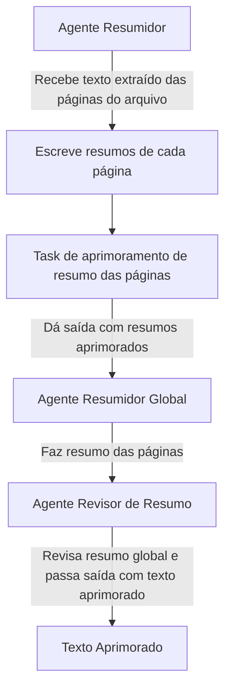

# RELATÓRIO TÉCNICO

Dados do experimento:
- ID do experimento: 2024-06-05_15-29-02
- Data: 2024-06-05
- Hora: 15-29-02

Autor(es):
- Lays

## Sumário executivo

- Protótipo de uma ferramenta de automação de tarefas, permitindo que os agentes utilizem uma funcionalidade em Python para extrair textos de arquivos PDF e resumir brevemente o conteúdo.

## 1. Introdução

- É uma ferramenta desenvolvida com o propósito de explorar o framework CrewAI, oferecendo funcionalidades que se adequam às necessidades do setor.

## 2. Procedimento experimental

### 2.1. Materiais:

LLMs:
- llama3-70b-8192

### 2.2. Métodos

Configuração experimental:

- Agentes: agente_resumidor_por_pagina, agente_de_resumo_global, agente_revisor_do_resumo_global.
- Tarefas: tarefa_resumo_paginas, tarefa_de_aprimoramento_de_resumo, tarefa_de_resumo_global, tarefa_de_revisão_de_resumo_global.
- Objetivos: Possibilitar que os agentes elaborem resumos claros e concisos dos textos extraídos de arquivos PDF utilizando uma função em Python externa ao framework.

- Fluxo dos agentes:

## Resultados/Análise

...

## Conclusão

O framework atendeu a grande parte das necessidades, mas ainda precisa de melhorias.

## Referências

- [Site oficial - Crewai](https://www.crewai.com/)
- [Curso com o criador do Crewai - Multi AI Agent Systems with crewAI](https://www.deeplearning.ai/short-courses/multi-ai-agent-systems-with-crewai/)