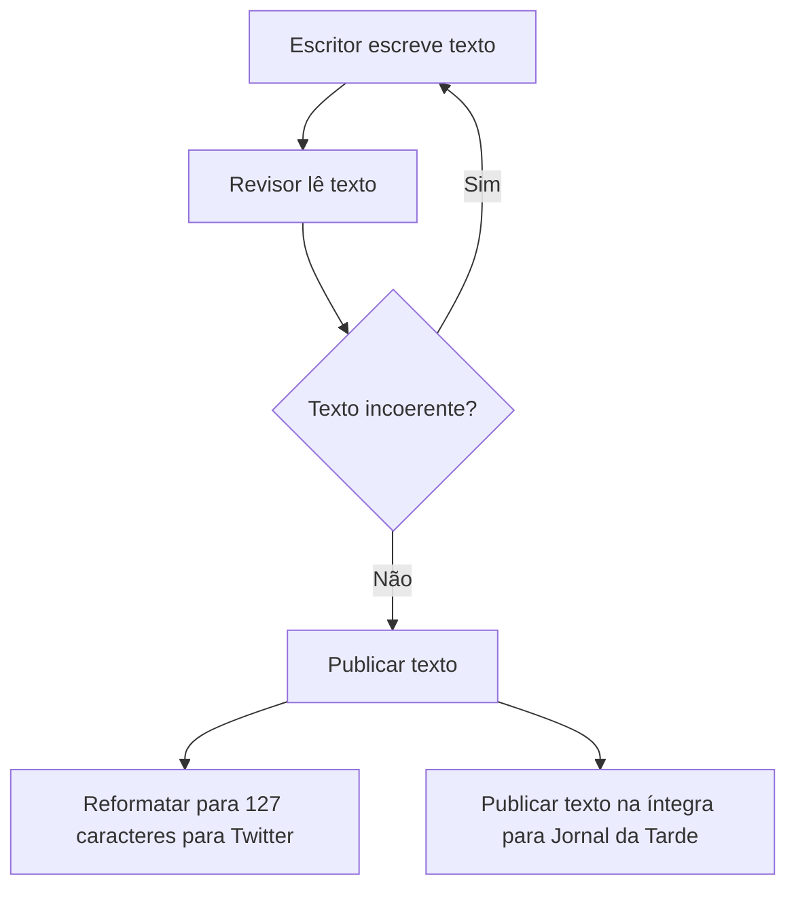

# RELATÓRIO TÉCNICO

Dados do experimento:
- ID do experimento: 2024-06-05_15-29-02
- Data: 2024-06-05
- Hora: 15-29-02

Autor(es):
- Lays

## Sumário executivo

...

## 1. Introdução

...

## 2. Procedimento experimental

### 2.1. Materiais:

LLMs:
- ...
- ...

### 2.2. Métodos

Configuração experimental:

- Agentes: ...
- Tarefas: ...
- Objetivos: ...

## Resultados/Análise

...

## Conclusão

...

## Referências

...